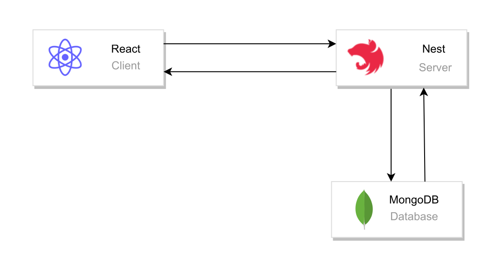
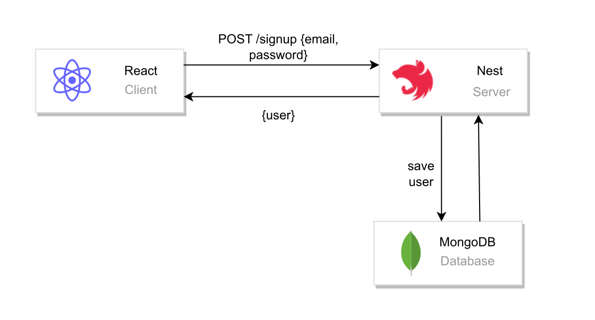
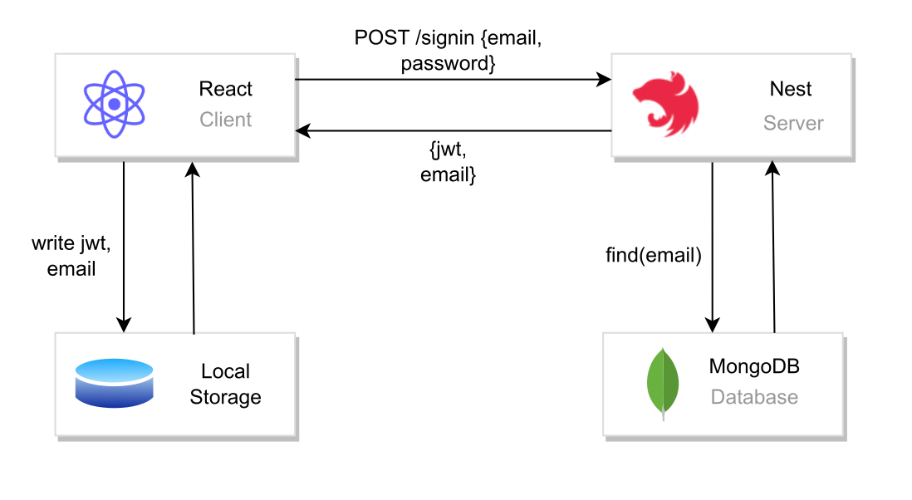

# Auth app API

## Description

Simple REST API for user authentication.

## Table of contents

- [Techstack](#techstack)
- [Prerequisities](#prerequisities)
- [Architecture](#architecture)
- [Authentication flow](#authentication-flow)
- [Postman](#postman)
- [Endpoints](#endpoints)
- [To run](#to-run)

## Techstack

- `Nest.js`

## Prerequisities

- `Node.js`
- `MongoDB`

## Architecture

Application use `REST` style architecture.
`Client` side is created in `React.js` <br/>
`Server` side is created in `Nest.js`
Application use `MongoDB` atlas cloud.

<details>

<summary>General arch</summary>


</details>

## Authentication flow

### Sign up

User sign up with email and password credentials. Server validate if credentials match requirements. Email has to be email, password has to be in 6-20 characters range.
If email has proper syntax, server logic check if user with provided email already exists.
If not user object is returned from the server.
User is redirected to sign in page.

<details>
<summary>Flow</summary>


</details>

### Sign in

User sign in with email and password credentials. Server validate credentials same as in `/signup` route (email syntax check and password length). Beside of that, server check if user with provided email exists if so, after correct validation server response with jwt and user email.
Token and email are stored in local storage, based on those values user can access homepage. If local storage is empty, user is being redirected to sign in page.

<details>
<summary>Flow</summary>


</details>

## Postman

You can play with API just import provided [Postman file](./auth-api.postman_collection.json) in Postman client.

## Endpoints

| Method |              Endpoint              |
| :----: | :--------------------------------: |
| `POST` | [`/auth/signup`](./docs/signup.md) |
| `POST` | [`/auth/signin`](./docs/signin.md) |

## To run

Clone repository.

```sh
git clone https://github.com/wojciechszmelczerczyk/nest-auth-api.git
```

Navigate to project directory.

```sh
cd ./nest-auth-api
```

Install dependencies.

```sh
npm i
```

Create `.env` file in project root directory and populate with your config.

```docker
DB_URI=

JWT_SECRET=
```

Run API in development mode.

```sh
npm run start:dev
```
